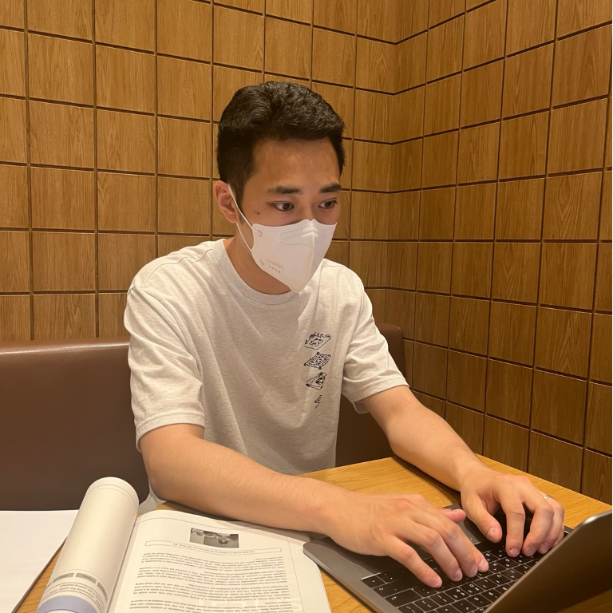

 

## **Sunwoong Hur**

Engineer in Mechtronics Research at Samsung Electronics Inc.

Feb.2021 - present

## **Education**

M.S. in Mechanical Engineering, Yonsei University, Seoul, South Korea (2021)

B.S. in Mechanical Engineering, Yonsei University, Seoul, South Korea (2018)

## **Research Interests**

Computational imaging, Optical technology, Metrology and Inspection, 

Optics, Inverse problem, Signal processing, Reconstruction Algorithms

## **Awards, Honors, and Scholarships**

**Graduate Student Research Assistant Scholarships** | Yonsei University | 2020

**Graduate Student Teaching Assistant Scholarships** | Yonsei University | 2019, 2020

**Brain Korea 21 Plus Scholarship** **|** National Research Foundation | 2019, 2020

**Brain Korea 21 Plus Scholarship** **|** National Research Foundation | 2019, 2020

**Best Paper Awards** | Optics and Photonics Congress | 2019

**Graduated with High Honors (Top 3%)** **|** Yonsei University | 2018 (Top 3%)

**Selected as the Honors** | Yonsei University | 2015 (2nd semester), 2016 (1st, 2nd semester)

**Truth Scholarship for Honors** **|** Yonsei University | 2016, 2017, 2018

**Korea National Science and Technology Undergraduate Scholarship** **|** Korea Scholarship Foundation | 2016

**Korea National Science and Technology Undergraduate Scholarship** **|** Korea Scholarship Foundation | 2016

**Samsong-Sponsored Scholarship** **|** Scholarship Association of Samsong | 2016

**Megastudy Freshman Admission Scholarship** **|** Megastudy Inc. | 2012

